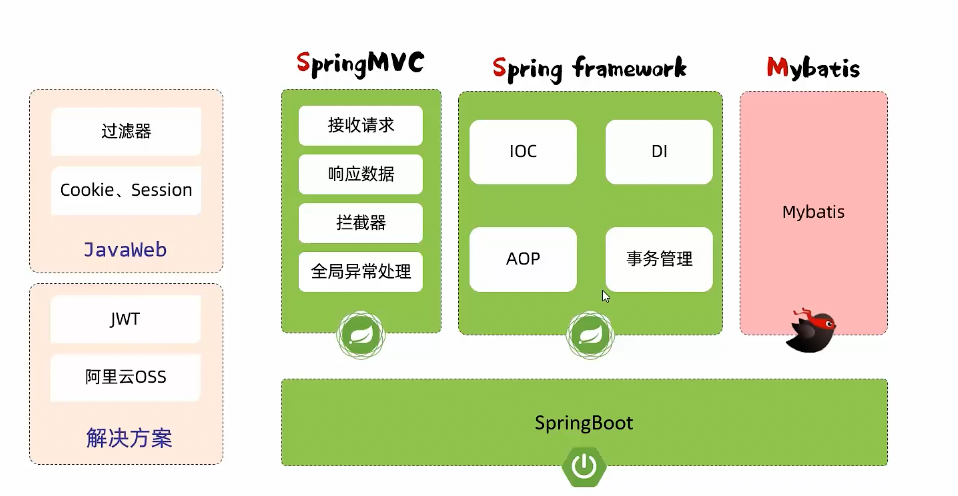

> 本文作者：[程序员小王](https://github.com/Little-Drummer)
>
> 本站地址：[https://little-drummer.github.io/my-docs-hope/](https://little-drummer.github.io/my-docs-hope/)
>
> 项目GitHub地址：[https://github.com/Little-Drummer/my-docs-hope](https://github.com/Little-Drummer/my-docs-hope)
>

## IOC容器

Spring IOC是Spring框架中的一个重要概念，它代表着控制反转（Inversion of Control)。

控制反转是一种软件设计原则，它将对象或程序的某些部分的控制权交给容器或框架。在传统编程中，我们的代码调用库，而在控制反转中，框架接管了程序的流程并调用我们的代码。为了实现这一点，框架使用具有附加行为的抽象。如果我们想要添加自己的行为，我们需要扩展框架的类或插入自己的类。这种体系结构的优点是：解耦执行任务与其实现，使在不同实现之间切换更容易，程序更具模块化，通过隔离组件或模拟其依赖项更容易测试程序，并允许组件通过契约进行通信。我们可以通过各种机制实现控制反转，例如：策略设计模式、服务定位器模式、工厂模式和依赖注入（DI）。依赖注入是一种模式，我们可以使用它来实现控制反转，在这种情况下，被反转的控制是设置对象的依赖项。将对象与其他对象连接或将对象“注入”到其他对象中是由汇编器而不是对象本身完成的。

Spring IOC容器是Spring框架中用于实现IOC的核心部分之一。它负责创建对象、维护对象之间的关系以及管理它们的整个生命周期 ]通过使用Spring IOC容器，我们可以将应用程序中各个组件之间的依赖关系从代码中解耦出来，并将其配置在XML文件或Java注释中 

### 注解

#### @lazy

Bean懒加载注解  加上lazy注解后会等到实例被第一次调用时才实例化

#### @autowried

autowried注解会将实例自动注入到变量中

#### @Scope

* prototype 多例bean  每次使用bean都会创建一个实例
* singleton 单例bean

#### @Bean

* 如果要管理的bean对象来自于第三方〈不是自定义的)，是无法用@Component 及衍生注解声明bean的，就需要用到@Bean注解。
* 若要管理的第三方bean对象，建议对这些bean进行集中分类配置，可以通过@Configuration注解声明一个配置类。

```java
@Configuration
public class BeanConfig {
//    @Bean
//    public JwtUtils jwtUtils() {
//        return new JwtUtils();
//    }
}
```
### 将第三方模块中的Bean加入到IOC
#### 方案一
1. 在Maven中加入模块的坐标
2. 通过ComponentScan("")扫描对应报名和默认包

#### 方案二
1. 导入普通类  通过@import(对应类.class)
2. 导入配置类  导入带有@configuration的类  类中的Bean对象会被自动导入
3. 导入实现自ImportSelector的类  类要实现selectImports方法
4. 通过第三方类提供的@EnableXXX 注解

## 自动配置原理
### 启动类注解
* 该注解标识在SpringBoot工程引导类上，是SpringBoot中最最最重要的注解。该注解由三个部分组成:
* @SpringBootConfiguration:该注解与@Configuration注解作用相同，用来声明当前也是一个配置类。@ComponentScan:组件扫描，默认扫描当前引导类所在包及其子包。
* @EnableAutoConfiguration: SpringBoot实现自动化配置的核心注解。
  * 底层是Import注解  导入的是(AutoConfigurationImportselectnr.class)
  * AutoConfigurationImportselectnr.selectImports  获取**org.springframework.boot.autoconfigure.AutoConfiguration.imports**中的全类名实现注入
  * Spring并不会加载全部的Bean  通过[@Conditional条件注入]()根据当前环境注入

### @Conditional条件注入

* @Conditional0nClass(name = "io.jsonwebtoken.Jwts")//当前环境存在指定的这个类时，才声明该bean
* @ConditionalonMissingBean //当不存在当前类型的bean时，才声明该bean
* Conditiona10nProperty(name = “name" , havingValue = "itheima")//配置文件中存在对应的属性和值，才注册bean到OC容器。

## 三层注解

### Controller注解和RestController注解的区别

@Controller 包括了 @RestController。@RestController 是 Spring4 后新加的注解，从 RestController 类源码可以看出 @RestController 是 @Controller 和 @ResponseBody 两个注解的结合体。

@Controller返回对象   @ResponseBody 返回json数据  用于前端请求的异步请求

- @Controller 一般应用在有返回界面的应用场景下.

  例如，管理后台使用了 thymeleaf 作为模板开发，需要从后台直接返回 Model 对象到前台，那么这时候就需要使用 @Controller 来注解。

- @RestController 如果只是接口，那么就用 RestController 来注解.

  例如前端页面全部使用了 Html、Jquery来开发，通过 Ajax 请求服务端接口，那么接口就使用 @RestController 统一注解。

### @Service注解

作用在服务层

### Component注解

Component注解是通用型注解,用于把JavaBean注入到Spring IOC容器中用以自动注入

Controller、Service、Repository三个是其具体注解分别表示控制层、服务层、持久层(Dao层 Data Access Object)数据访问层

### mapper注解

mybatis的专有注解用于数据访问

### Repository

持久层注解

## 全局异常捕获器

```java
@RestControllerAdvice  // =@ControllerAdvice+@responseBody
public class GlobalExceptionHandler {
    @ExceptionHandler(Exception.class)
    public Result ex(Exception exception) {
        exception.printStackTrace();
        return Result.error("对不起，操作失败");
    }
}
```

## Spring请求拦截器

1. 定义拦截器类继承自HandlerInterceptor
2. 实现HandlerInterceptor中的方法
3. 定义config类实现自WebMvcConfigurer
4. 实现addInterceptors方法
5. 通过拦截器注册器注册拦截器并配置拦截路径和排除路径

```java
@Override
public void addInterceptors(InterceptorRegistry registry) { 			                     		registry.addInterceptor(loginCheckInterceptor).addPathPatterns("/**").excludePathPatterns("/login");
}
```

### transaction事务注解

事务是一组操作的集合，它是一个不可分割的工作单位，这些操作要么同时成功，要么同时失败

加上transaction注解之后Spring框架会自动开启事务、碰到异常后会自动回滚事务

默认情况下transaction只在运行时异常会回滚

加上Transactional(rollbackFor = Exception.class)后会回滚所有异常

当出现事务传播之后参数propagation用来控制事务传播行为

如果有无论如何都要执行的代码时则需要开启新事务

```java
propagation = Propagation.REQUIRES  //表示加入事务
propagation = Propagation.REQUIRES_NEW  //表示开启新事务
```

## [JWT令牌](https://jwt.io)

* 传统的客户端cookie和服务器端session会话跟踪技术都存在着许多问题

例如:

* cookie无法在移动端使用、用户可以自己禁用cookie、cookie不能跨域

* session无法在服务器集群的情况下直接使用、用于session基于cookie所以包含cookie的所有缺点

**JWT令牌**定义了一种简洁的、自包含的格式，用于在通信双方以json数据格式安全的传输信息。由于数字签名的存在，这些信息是可靠的。

```xml
<dependency>
    <groupId>io.jsonwebtoken</groupId>
    <artifactId>jjwt</artifactId>
    <version>0.9.1</version>
</dependency>
```

### JWT生成

```java
HashMap<String, Object> claims = new HashMap<>();
        claims.put("name", "wja");
String jwt = Jwts.builder()
                .signWith(SignatureAlgorithm.HS256, "wja")
                .setClaims(claims)
                .setExpiration(new Date(System.currentTimeMillis() + 3600 * 1000))
                .compact();
```

### JWT解析

```java
Claims claims = Jwts.parser().setSigningKey("JWT密钥").parseClaimsJws("JWT令牌").getBody();
System.out.println(claims);
```

## Spring配置项

```yaml
# mybatis-plus日志
mybatis-plus:
    configuration:
        log-impl: org.apache.ibatis.logging.stdout.StdOutImpl
spring:
    datasource:
    # mysql配置
        driver-class-name: com.mysql.cj.jdbc.Driver
        password: 123456
        url: jdbc:mysql://localhost:3306/tlias
        username: root
    servlet:
        multipart:
        # 单次上传文件的大小限制
            max-file-size: 10MB
        # 一次性上传多个文件的大小限制
            max-request-size: 100MB
# 阿里云OSS配置  配合配置自动注入
aliyun:
    oss:
        endpoint: https://oss-cn-beijing.aliyuncs.com
        accessKeyId: LTAI5tC2BmQiA5TqV7rJRLjC
        accessKeySecret: 7fLw89vMJjTWnxZ7DhDEgi6GXidWRS
        bucketName: web-tlias-wja-test
#开启事务管理的日志
logging:
    level:
      org.springframework.jdbc.support.JdbcTransactionManager: debug

```

## AOP面向切面编程

AOP: Aspect Oriented Programming (面向切面编程、面向方面编程)，其实就是面向特定方法编程。(其实就是动态代理技术)

* 动态代理是面向切面编程最主流的实现。而SpringAOP是Spring框架的高级技术，旨在管理bean对象的过程中，主要通过底层的心动态代理机制，对特定的方法进行编程。
* 一但切入点类或方法被执行Spring IOC 注入的则是被通知增强之后的代理对象,并非常规的对象

### 在Maven中引入SpringAOP

```xml
<dependency>
    <groupId>org.springframework.boot</groupId>
    <artifactId>spring-boot-starter-aop</artifactId>
</dependency>
```

### SpringAOP快速入门

```java
@Component
@Aspect  //AOP类
@Slf4j
public class TimeAspect {
    /**
     * 记录运行时间
     *
     * @param pjp pjp
     * @return {@link Object}
     * @throws Throwable throwable
     */
    @Around("execution(* com.wja.tlias_project.service.*.*(..))") //切入点表达式
    public Object recordRunningTime(ProceedingJoinPoint pjp) throws Throwable {
        long startTime = System.currentTimeMillis();
        Object result = pjp.proceed();  //调用原始方法且保存原始方法的返回值
        long endTime = System.currentTimeMillis();
        log.info(pjp.getSignature() + "方法的耗时为{}ms", endTime-startTime);
        return result;  //返回原始方法的返回值
    }
}
```

### AOP通知类型

* @Around:环绕通知  环绕通知，此注解标注的通知方法在目标方法前、后都被执行
  * @Around环绕通知需要自己调用ProceedingJoinPoint.proceed(）来让原始方法执行，其他通知不需要考虑目标方法执行
  * @Around环绕通知方法的返回值，必须指定为object，来接收原始方法的返回值。


* @Before:前置通知，此注解标注的通知方法在目标方法前被执行
* @After :后置通知，此注解标注的通知方法在目标方法后被执行，无论是否有异常都会执行
* @AfterReturning : 返回后通知，此注解标注的通知方法在目标方法后被执行，有异常不会执行
* @AfterThrowing :异常后通知，此注解标注的通知方法发生异常后执行

### PointCut切入点表达式提取

该注解的作用是将公共的切点表达式抽取出来，需要用到时引用该切点表达式即可。

```java
@pointcut("execution("")")
public void pt(){};
```

### @Order控制通知执行顺序

用@Order(数字)加在切面类上来控制顺序

目标方法前的通知方法:数字小的先执行

目标方法后的通知方法:数字小的后执行

### 切入点表达式

当匹配的多个方法之间没有共同的特征时  可以用**||**、**&&、!非)**进行连接

#### execution

execution主要根据方法的返回值、包名、类名、方法名、方法参数等信息来匹配，语法为:**execution(访问修饰符?返回值包名.类名.?方法名(方法参数) throws异常?)**

#### @annotation(注解全类名)

@annotation切入点表达式，用于匹配标识有特定注解的方法。

#### 通配符

\* 单个独立的任意符号，可以通配任意返回值、包名、类名、方法名、任意类型的一个参数，也可以通配包、类、方法名的一部分

> execution(* com.*.service.*.update*(*))

.. 多个连续的任意符号，可以通配任意层级的包，或任意类型、任意个数的参数

> execution(* com.itheima. .Deptservice.*( .. ))

### 切入点书写建议

* 所有业务方法名在命名时尽量规范，方便切入点表达式快速匹配。如:查询类方法都是find开头，更新类方法都是update开头
* 描述切入点方法通常基于接口描述，而不是直接描述实现类，增强拓展性。
* 在满足业务需要的前提下，尽量缩小切入点的匹配范围。如:包名匹配尽量不使用...，使用*匹配单个包。

## Maven高级

### 分模块设计与开发

* 尽量将项目分成多个模块以方便管理
* 将公共部分提取出来  (例如实体类,工具类)

### Maven依赖继承

* 在pom文件中定义parent标签来继承父工程
* 通过relativePath指定父工程的pom文件位置
* 指定打包方式为pom  <packaging>pom</packaging>

## 版本锁定

* 通过父工程统一管理子工程的依赖版本
* 通过dependencyManagement统一管理

> dependencyManagement不会引入依赖

* ```
  <dependencyManagement>
      <dependencies>
      	<dependency>
      	
      	</dependency>
      </dependencies>
  </dependencyManagement>
  ```

### 属性引用

```xml
<properties>
    <java.version>17</java.version>
    <lombok.version>111</lombok.version>
    <a1>${lombok.version}}</a1>
</properties>
```

### Maven聚合

将多个模块组织成一个整体，同时进行项目的构建。

maven中可以通过\<modules\>设置当前聚合工程所包含的子模块名称

### Maven私服

私服是一种特殊的远程仓库，它是架设在局域网内的仓库服务，用来代理位于外部的中央仓库，用于解决团队内部的资源共享与资源同步问题。

## 公共字段自动填充

### 1.1 问题分析

在上一章节我们已经完成了后台系统的**员工管理功能**和**菜品分类功能**的开发，在**新增员工**或者**新增菜品分类**时需要设置创建时间、创建人、修改时间、修改人等字段，在**编辑员工**或者**编辑菜品分类**时需要设置修改时间、修改人等字段。这些字段属于公共字段，也就是也就是在我们的系统中很多表中都会有这些字段，如下：

| **序号** | **字段名**     | **含义** | **数据类型** |
|--------|-------------|--------|----------|
| 1      | create_time | 创建时间   | datetime |
| 2      | create_user | 创建人id  | bigint   |
| 3      | update_time | 修改时间   | datetime |
| 4      | update_user | 修改人id  | bigint   |

而针对于这些字段，我们的赋值方式为： 

1). 在新增数据时, 将createTime、updateTime 设置为当前时间, createUser、updateUser设置为当前登录用户ID。

2). 在更新数据时, 将updateTime 设置为当前时间, updateUser设置为当前登录用户ID。

目前,在我们的项目中处理这些字段都是在每一个业务方法中进行赋值操作

### 1.2 实现思路

在实现公共字段自动填充，也就是在插入或者更新的时候为指定字段赋予指定的值，使用它的好处就是可以统一对这些字段进行处理，避免了重复代码。在上述的问题分析中，我们提到有四个公共字段，需要在新增/更新中进行赋值操作, 具体情况如下: 

| **序号** | **字段名**     | **含义** | **数据类型** | **操作类型**      |
|--------|-------------|--------|----------|---------------|
| 1      | create_time | 创建时间   | datetime | insert        |
| 2      | create_user | 创建人id  | bigint   | insert        |
| 3      | update_time | 修改时间   | datetime | insert、update |
| 4      | update_user | 修改人id  | bigint   | insert、update |

**实现步骤：**

1). 自定义注解 AutoFill，用于标识需要进行公共字段自动填充的方法

2). 自定义切面类 AutoFillAspect，统一拦截加入了 AutoFill 注解的方法，通过反射为公共字段赋值

3). 在 Mapper 的方法上加入 AutoFill 注解


若要实现上述步骤，需掌握以下知识(之前课程内容都学过)

**技术点：**枚举、注解、AOP、反射

### 1.3 代码开发

按照上一小节分析的实现步骤依次实现，共三步。

#### 1.3.1 步骤一

**自定义注解 AutoFill**              

进入到sky-server模块，创建com.sky.annotation包。

```java
package com.sky.annotation;

import com.sky.enumeration.OperationType;
import java.lang.annotation.ElementType;
import java.lang.annotation.Retention;
import java.lang.annotation.RetentionPolicy;
import java.lang.annotation.Target;

/**
 * 自定义注解，用于标识某个方法需要进行功能字段自动填充处理
 */
@Target(ElementType.METHOD)
@Retention(RetentionPolicy.RUNTIME)
public @interface AutoFill {
    //数据库操作类型：UPDATE INSERT
    OperationType value();
}
```

其中OperationType已在sky-common模块中定义

```java
package com.sky.enumeration;

/**
 * 数据库操作类型
 */
public enum OperationType {

    /**
     * 更新操作
     */
    UPDATE,

    /**
     * 插入操作
     */
    INSERT
}
```


#### 1.3.2 步骤二

**自定义切面 AutoFillAspect**

在sky-server模块，创建com.sky.aspect包。

```java
package com.sky.aspect;

/**
 * 自定义切面，实现公共字段自动填充处理逻辑
 */
@Aspect
@Component
@Slf4j
public class AutoFillAspect {

    /**
     * 切入点
     */
    @Pointcut("execution(* com.sky.mapper.*.*(..)) && @annotation(com.sky.annotation.AutoFill)")
    public void autoFillPointCut(){}

    /**
     * 前置通知，在通知中进行公共字段的赋值
     */
    @Before("autoFillPointCut()")
    public void autoFill(JoinPoint joinPoint){
        /////////////////////重要////////////////////////////////////
        //可先进行调试，是否能进入该方法 提前在mapper方法添加AutoFill注解
        log.info("开始进行公共字段自动填充...");

    }
}
```

**完善自定义切面 AutoFillAspect 的 autoFill 方法**

```java
package com.sky.aspect;

import com.sky.annotation.AutoFill;
import com.sky.constant.AutoFillConstant;
import com.sky.context.BaseContext;
import com.sky.enumeration.OperationType;
import lombok.extern.slf4j.Slf4j;
import org.aspectj.lang.JoinPoint;
import org.aspectj.lang.annotation.Aspect;
import org.aspectj.lang.annotation.Before;
import org.aspectj.lang.annotation.Pointcut;
import org.aspectj.lang.reflect.MethodSignature;
import org.springframework.stereotype.Component;
import java.lang.reflect.Method;
import java.time.LocalDateTime;

/**
 * 自定义切面，实现公共字段自动填充处理逻辑
 */
@Aspect
@Component
@Slf4j
public class AutoFillAspect {

    /**
     * 切入点
     */
    @Pointcut("execution(* com.sky.mapper.*.*(..)) && @annotation(com.sky.annotation.AutoFill)")
    public void autoFillPointCut(){}

    /**
     * 前置通知，在通知中进行公共字段的赋值
     */
    @Before("autoFillPointCut()")
    public void autoFill(JoinPoint joinPoint){
        log.info("开始进行公共字段自动填充...");

        //获取到当前被拦截的方法上的数据库操作类型
        MethodSignature signature = (MethodSignature) joinPoint.getSignature();//方法签名对象
        AutoFill autoFill = signature.getMethod().getAnnotation(AutoFill.class);//获得方法上的注解对象
        OperationType operationType = autoFill.value();//获得数据库操作类型

        //获取到当前被拦截的方法的参数--实体对象
        Object[] args = joinPoint.getArgs();
        if(args == null || args.length == 0){
            return;
        }

        Object entity = args[0];

        //准备赋值的数据
        LocalDateTime now = LocalDateTime.now();
        Long currentId = BaseContext.getCurrentId();

        //根据当前不同的操作类型，为对应的属性通过反射来赋值
        if(operationType == OperationType.INSERT){
            //为4个公共字段赋值
            try {
                Method setCreateTime = entity.getClass().getDeclaredMethod(AutoFillConstant.SET_CREATE_TIME, LocalDateTime.class);
                Method setCreateUser = entity.getClass().getDeclaredMethod(AutoFillConstant.SET_CREATE_USER, Long.class);
                Method setUpdateTime = entity.getClass().getDeclaredMethod(AutoFillConstant.SET_UPDATE_TIME, LocalDateTime.class);
                Method setUpdateUser = entity.getClass().getDeclaredMethod(AutoFillConstant.SET_UPDATE_USER, Long.class);

                //通过反射为对象属性赋值
                setCreateTime.invoke(entity,now);
                setCreateUser.invoke(entity,currentId);
                setUpdateTime.invoke(entity,now);
                setUpdateUser.invoke(entity,currentId);
            } catch (Exception e) {
                e.printStackTrace();
            }
        }else if(operationType == OperationType.UPDATE){
            //为2个公共字段赋值
            try {
                Method setUpdateTime = entity.getClass().getDeclaredMethod(AutoFillConstant.SET_UPDATE_TIME, LocalDateTime.class);
                Method setUpdateUser = entity.getClass().getDeclaredMethod(AutoFillConstant.SET_UPDATE_USER, Long.class);

                //通过反射为对象属性赋值
                setUpdateTime.invoke(entity,now);
                setUpdateUser.invoke(entity,currentId);
            } catch (Exception e) {
                e.printStackTrace();
            }
        }
    }
}
```


#### 1.3.3 步骤三

**在Mapper接口的方法上加入 AutoFill 注解**

以**CategoryMapper**为例，分别在新增和修改方法添加@AutoFill()注解，也需要**EmployeeMapper**做相同操作

```java
package com.sky.mapper;

@Mapper
public interface CategoryMapper {
    /**
     * 插入数据
     * @param category
     */
    @Insert("insert into category(type, name, sort, status, create_time, update_time, create_user, update_user)" +
            " VALUES" +
            " (#{type}, #{name}, #{sort}, #{status}, #{createTime}, #{updateTime}, #{createUser}, #{updateUser})")
    @AutoFill(value = OperationType.INSERT)
    void insert(Category category);
    /**
     * 根据id修改分类
     * @param category
     */
    @AutoFill(value = OperationType.UPDATE)
    void update(Category category);

}
```

**同时**，将业务层为公共字段赋值的代码注释掉。

1). 将员工管理的新增和编辑方法中的公共字段赋值的代码注释。

2). 将菜品分类管理的新增和修改方法中的公共字段赋值的代码注释。


## 总结  




